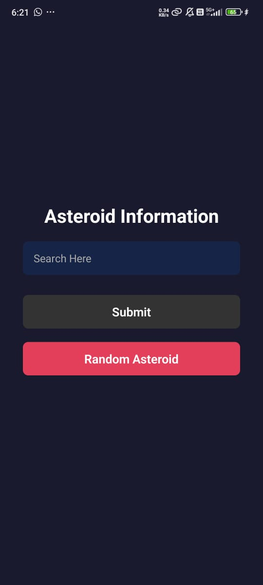
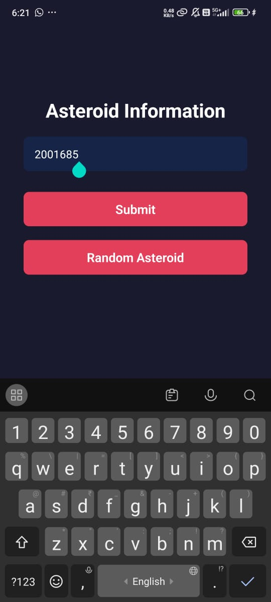
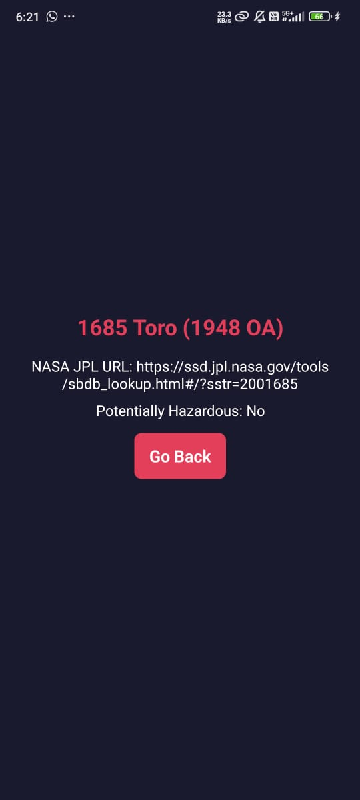

# Asteroid Information App

Welcome to the **Asteroid Information App**, a React Native application designed to provide detailed information about asteroids using NASA's Near-Earth Object Web Service API. This app allows users to search for asteroids by ID or explore random asteroid data, making space exploration more accessible.

## Features

- **Asteroid Search**: Input a specific asteroid ID to fetch detailed information about that asteroid, including name, potential hazard status, and a NASA JPL URL for further information.
- **Random Asteroid**: Tap to explore a random asteroid and access its information instantly.
- **Asteroid Details**: View essential data, including the asteroid’s name, potential hazard status, and links to additional resources.

## Screenshots

### Home Screen
The Home Screen enables users to search for an asteroid by entering its ID or load details of a random asteroid with one tap.




### Asteroid Details Screen
The details screen displays key information about the selected asteroid, such as its name, hazard status, and a link to the NASA JPL page for further details.



---

This application offers a simple and informative interface for learning about asteroids, providing users with an easy way to access information about near-Earth objects.

## Installation

To get started with the Sport Shoe Shop App, clone the repository and follow the installation instructions below:

1. **Clone the Repository**
   ```bash
   git clone [repository-url]
   ```

2. **Navigate to the Project Directory**
   ```bash
   cd sport-shoe-shop-app
   ```

3. **Install Dependencies**
   ```bash
   npm install
   ```

4. **Run the App**
   ```bash
   npm start
   ```

## Technologies Used

- **React Native**: For building the mobile application.
- **Expo**: For easy development and deployment.
- **React Navigation**: For seamless navigation between screens.
- **Ionicons**: For beautiful and customizable icons.

## Contributing

Contributions are welcome! If you have suggestions or improvements, feel free to open an issue or submit a pull request.

## License

This project is licensed under the MIT License.

---